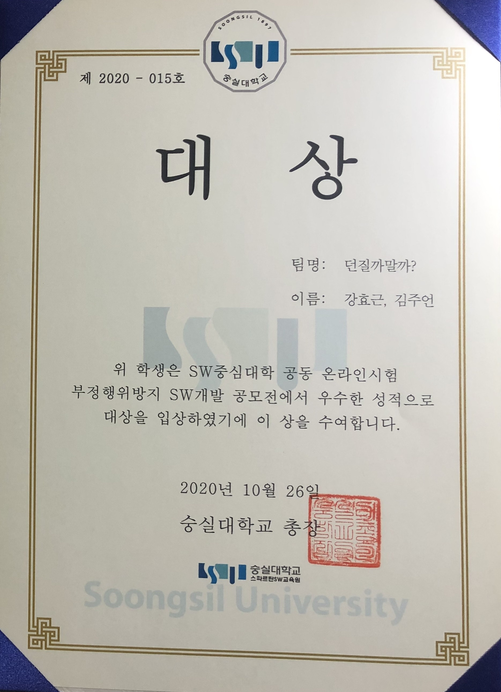

2020.08~2020.09) 온라인 시험 부정행위 방지 공모전 (빅브라더즈)
- 코로나시대로 넘어와서 비대면 온라인 시험의 부정행위를 방지하기 위하여, 시험중에는 화면공유가 되어 감독한다. 학생들은 시험을 보는 동안 타임랩스를 찍어두고, 시험이 끝나면 타임랩스 파일과 답안을 같이 제출한다. 감독관은 시험이 끝난 후 학생들의 타임랩스 파일과 답안으로 평가한다.
- WebRTC 기반의 오픈소스 openvidu를 사용하여, 화면공유 기술을 구현.
- 기획, 시스템 설계, Back-End Rest API서버를 구현하였음. 
- 사용 언어 : node.js , openvidu(WebRTC), react.js
- 팀원과 Front와 Back을 나누어 협업하고, git의 활용을 본격적으로 해보면서 많은 것을 배울 수 있었다. 하나의 서비스를 제대로 구현해내기 위해서는 많은 지식이 필요한 것을 알 수 있었다. 
- [소스코드](https://github.com/geun9716/rope_openvidu)
- [시연영상](https://youtu.be/hovZIJglQks)
- 수상내역 : 2020년도 온라인시험 부정행위방지(ROPE) SW개발 공모전 (대상), 2020.10.26

